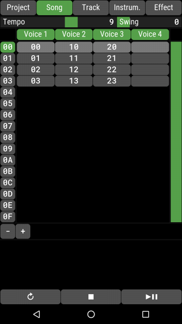
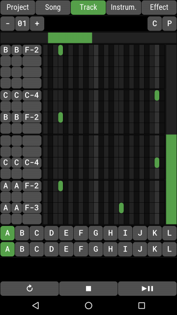
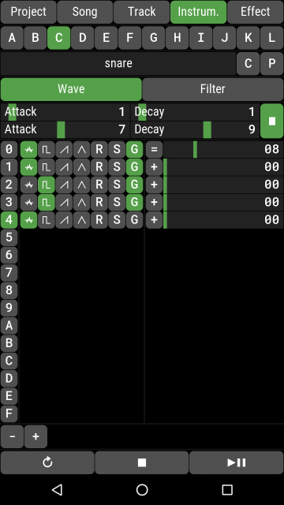
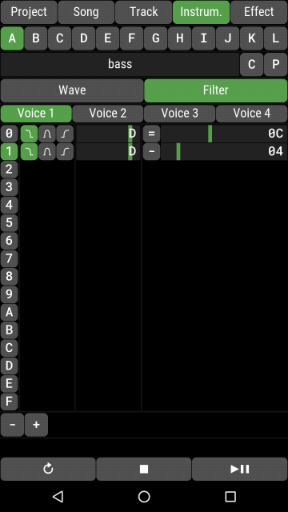
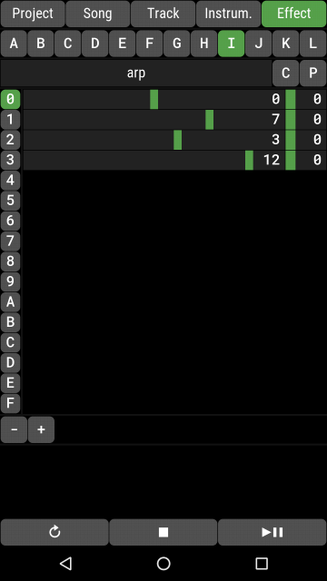

# Insidious

This is a chiptune tracker for android that's trying to sound a lot like the MOS Technology SID.
The synth code is based on TinySID by Tammo Hinrichs (kb).
Some details of the SID chip aren't emulated correctly but it's close enough, I think.
Also, I added a fourth voice (but you don't have to use it if you don't want to, of course).

The tracker is highly inspired by [lft's Blackbird](https://csdb.dk/release/?id=161554).

Get the APK [here](http://www.langnerd.de/insidious/insidious.apk)!

### Screeshots

### How to build

In order to compile for android the following setup is prerequisite:

    $ ls ..
	android-ndk-r16     # android NDK
    insidious           # the project folder; its name doesn't matter
    SDL2-2.0.7          # SDL source
    SDL2_image-2.0.2    # SDL image source
    SDL2_mixer-2.0.2    # SDL mixer source
    tools_r25.2.5-linux # android SDK

Once you have that, run `make` like so:

	make android-install

### TODO

+ confirm load/save/delete
+ incremental OGG export
+ variable track length
+ documentation
